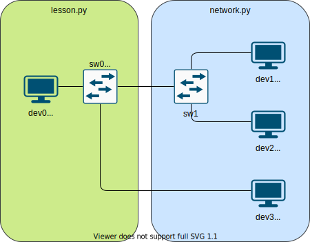

Lesson 2 - CAM Air
========================

In this lesson we will build a basic layer 2 switch.

What is a Switch?
-----------------

In the early days of networking the only way to connect multiple host together was to connect them all to the same physical media, and have them all cooperate in their use of that media. Unfortunately this approach is inflexible and does not scale well beyond a handful of hosts, because every host sees every other hosts traffic, and they are all sharing the same bandwidth. To fix this we need some device that all the hosts can connect to, which can coordinate sending messages between the connected hosts. This device is a switch.

OK, but why is the lesson called "CAM Air"?
-------------------------------------------

Because the most important part of a switch is the CAM (Content Addressable Memory) table. As discussed in ``lesson1`` every interface has a MAC address, and every ``Ethernet`` frame has a source and destination MAC address. A switch can have many host connected to it. When one of those hosts wants to send a frame to another host, it creates a frame with its MAC and the destination host MAC, and sends it out its interface. The Switch then gets the frame and has to figure out which of its interfaces to send it out of, to get to the destination. This is where the CAM table swoops into action. It is a big list of MAC address to interface mappings. This means when the switch gets the frame, it looks up the destination MAC in its CAM table, and sends it out the corresponding interface, where the destination host is patiently waiting for its frame.

Unfortunately this explanation only raises more questions
 * How does the CAM table get populated?
 * What happens if the destination MAC isn't in the CAM table?

How does the CAM table get populated?
-------------------------------------

When the Switch first boots up it has no idea what devices are connected to it. We could manually tell the switch what MAC address are connected to each of its interfaces, but this would get very old very quickly. Instead Switches are smart and try to 'learn' what MAC addresses are attached to each of its interfaces. The simplest way to do this is to look at the source MAC address for each frame it receives. If the Switch receives a frame on an interface from a device, then it knows that device is attached to that interface. So for every frame the Switch sees it will update its CAM table using the source MAC address from the frame.

What happens if the destination MAC isn't in the CAM table?
-----------------------------------------------------------

The Switch learning MAC addresses from the frame source address is all well and good, but doesnt really help if the device hasnt sent a frame yet, and therefore isnt in the CAM table. In this case the Switch has only one option, send the frame to everyone and hope the destination host gets it. This might seem like a crude solution, but generally traffic between hosts is bi-directional so the CAM table quickly gets populated and the frame spamming stops.

Remember that promiscuous mode?
-------------------------------

In ``lesson1`` we added an optional promiscuous mode to our ``L2Interface``. That becomes very important now. Your endpoint devices should not be set to promiscuous mode, otherwise they will try and process everyone elses traffic when the switch has to flood frames. Your Switch interfaces on the other hand need to be set to promiscuous mode, as none of the frames they are processing will be addressed to them. If your Switch interfaces are not in promiscuous mode then the Switch won't do anything.

How does the Switch know a host is unplugged?
---------------------------------------------

The short answer is it doesn't. The best guess it can make is if it hasn't seen traffic from that device for a little while, then the host is probably offline, so it removes those entries from its CAM table. Normally this timeout is around 5 minutes, but can be configured.

Get to work
-----------

This should be enough information to start fleshing out the ``Switch`` class in ``lesson.py``. The lesson network is setup as follows.

