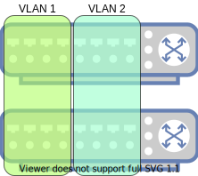
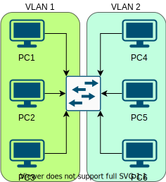
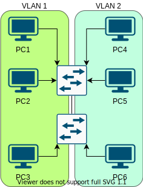

Lesson 3 - A VLAN, A Plan, A Canal, Panalva
===========================================

In this lesson we will learn about broadcast domains, and how we can use VLANs to break up layer 2 networks.

A Contrived Scenario
--------------------

You work for a company called Panalva. Panalva has two departments, HR and Sales. The problem at the moment is that both departments are connected to the same switch, and members of both departments are more tech savvy then first assumed. This means that Sales can see everyones payslips, and HR keeps spilling the beans on big sales deals. You've also noticed the network getting slower as you add more people, and more frames are getting flooded through the network.

The Panalva office is split over two levels, so you have a simple solution. Buy a switch for each level, and put HR on level 1 and Sales on level 2. Now HR can only see HR things, and Sales can only see Sales things. The two seperate networks are now running much faster as well.

But oww no! Now the managers in HR are complaining because people in Sales get a better view from level 2. But if you put HR people in the Sales floor then they can only access the Sales network. This is where VLANs swoop in to save the day.

Broadcast Domains
-----------------

Before we dive into VLANs, its probably a good idea to understand what a broadcast domain is. Your switch flooding frames is a form of broadcast. There are several protocols that rely on different forms of broadcasting. If I broadcast a frame, and you receive it then we are in the same broadcast domain. For your current switch, everything that is connected to it is in the same broadcast domain. Unless we have something to connect two broadcast domains, hosts in one cannot talk to hosts in another. Having excessively large broadcast domains is bad, both from a security, and performance perspective.

Splitting Broadcast Domains
---------------------------

As was explored in our contrived scenario, one way to split up a broadcast domain is to break things into physically seperate networks. This unfortunately isnt very flexible or cost effective.

A VLAN is a Virutal LAN, and aims to split a single physical network into several virtual networks. Each of these virtual networks is a seperate broadcast domain.

In this example the first 4 ports on each switch are in VLAN 1, and are a single broadcast domain. Everything connected to the second 4 ports on each switch are in VLAN 2, and are a seperate broadcast domain. A host connected to port 1 of a switch cant talk to a host connected to port 5 of the same switch, because they are in seperate VLANs. The switches only forward frames to hosts in the same VLAN.

How Does This Magic Work?
-------------------------

VLANs work by adding a tag to each frame, and only sending the frame out interfaces marked to handle that tag. Importantly the endpoint hosts are not aware that they are in a VLAN, or that other VLANs exist.

In this example if ``PC1`` wants to send a frame to ``PC3`` it creates a frame with the appropriate source and destination MAC and sends it. When the switch receives the frame it does the following things.

 * The interface ``PC1`` is connected to receives the frame.
 * The interface is marked as ``VLAN 1``, so it tags the incoming frame with ``VLAN 1``.
 * The switch adds an entry to the CAM table with source MAC and VLAN.
 * The switch does a CAM table lookup, and finds no matches.
 * It floods the frame out any interface marked as ``VLAN 1``. Importantly it removes tags from the frame before sending out those interfaces.
 * ``PC2`` and ``PC3`` receive the frame, but only ``PC3`` processes it because it matches the destination MAC.

Now ``PC3`` is sending a response frame back to ``PC1``.

 * The interface ``PC3`` is connected to receives the frame.
 * The interfaces is marked as ``VLAN 1``, so it tags the incoming frame with ``VLAN 1``.
 * The switch adds an entry to the CAM table with source MAC and VLAN.
 * The CAM table has an entry for ``PC1`` on ``VLAN 1``.
 * The out interface from the CAM table is marked with ``VLAN 1``, so it removes tags from the frame and sends it out the interface.

In this whole process none of the endpoints in ``VLAN 2`` saw any of the frames from ``VLAN 1``.

All of the ports on the switch in this example are referred to as ``Access`` ports, because they are connected to endpoint hosts, and provide them 'access' to the network.

VLAN Across Switches
--------------------

If we follow the previous steps with this example then we encounter a problem. An ``Access`` port can only be marked with one VLAN. This means if the connection between the two switches is an ``Access`` port then only one VLAN can communicate across it. This isnt very useful as once we need more than one switch in our network we can only have one VLAN shared across them. Obviously we need another type of switch port type. This other type of switch port is called a ``Trunk`` port.

The big differences between an ``Access`` and ``Trunk`` port is that a ``Trunk`` port accepts traffic for more than one VLAN, and ``Trunk`` ports send VLAN tagged frames. In the above example frames for ``VLAN 1`` and ``VLAN 2`` can both go across the trunk link, and since the frames have the appropriate VLAN tag the switch on the other side knows which VLAN the frame belong to, and can forward them correctly.

Default VLAN
------------

Before a switch port is configured it defaults to being an ``Access`` port. Every ``Access`` port must have an associated VLAN. As the name suggests, the Default VLAN is used as the default ``Access`` port VLAN. This means for an unconfigured switch everything is in the default VLAN. Normally ``VLAN 1`` is the default VLAN.

Allowed VLANs
-------------

By default a ``Trunk`` port allows all VLANs. Most switches allow you to configure a ``Trunk`` port with a list of allowed VLANs. Any frame the ``Trunk`` port sees that isnt in the allowed VLANs is dropped.

Native VLAN
-----------

Normally a ``Trunk`` port only sends and receives frames with VLAN tags. The native VLAN is a special case that makes the ``Trunk`` port act more like an ``Access`` port for one specific VLAN. This means any frame in the native VLAN the ``Trunk`` port sends, is sent without a tag, and any frame it receives without a tag it assumes is in the native VLAN. The native VLAN is mostly used to allow layer 2 protocols that aren't VLAN aware to traverse the network unmodified. It also allows layer 2 devices that arent VLAN aware (legacy devices) to be connected to trunk ports. The native VLAN defaults to the the Default VLAN.

Cooperation Is Key
------------------

The most important thing when configuring a ``Trunk`` link is that both ``Trunk`` ports on either end of the link are configured the same. This means both ports must be ``Trunk`` ports, have the same allowed VLANs, and have the same native VLAN. If any of these things mismatch then frames may be dropped, or 'jump' across VLANS. There are protocols that negotiate and enforce ``Trunk`` port configuration, but they are not covered in this lesson.

What is "Dot One Queue"?
------------------------

``IEEE 802.1Q`` is the standard that defines "Virtual LANs". Commonly VLAN tags are referred to as "dot1q" tags. The Scapy class to create a VLAN tag is the "Dot1Q" class. There are proprietary and legacy "Virtual LAN" protocols, however these are very much an exception. VLANs almost universally refer to ``802.1Q`` VLANs, and so the two terms are used interchangeably.

Where Does My Tag Fit?
----------------------

As discussed in ``lesson1`` there is a maximum size for frames being sent by our layer 2 interfaces. Our VLAN tag is 4 bytes long, which means we can either decrease MTU by 4 bytes, or increase the maximum frame size by 4 bytes. Decreasing the MTU means that every endpoint needs to be aware that VLAN tagging is taking place and adjust MTU so their frames dont get dropped when we try add a tag. Instead ``IEEE 802.1Q`` specifies that the VLAN tag is included in the ``Ethernet`` header and the maximum frame size is increased by 4 bytes. This mean maximum frame size goes from (mtu + 18) to (mtu + 22) for interfaces that are expecting to receive vlan tagged frames.

Go Forth
--------

That should be enough to get started adding VLANs to your switch. This lesson doesnt provide any tests so you'll have to write them all yourself.
